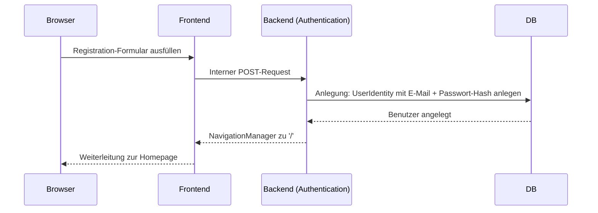
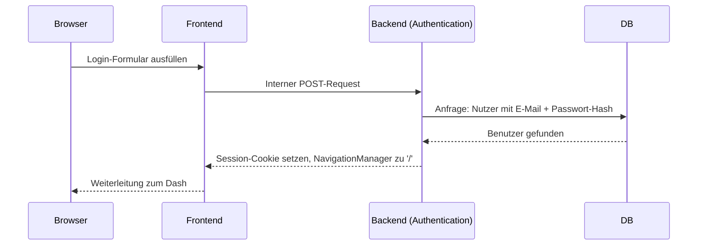
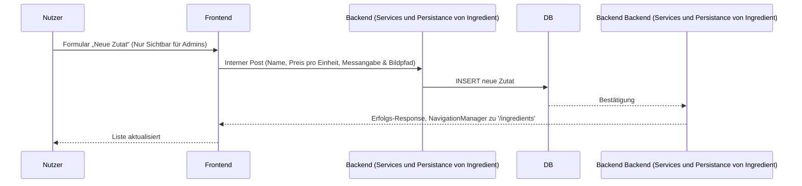

<!---
Artefakte der Systemdokumentation wurden teilweise auf basis
von ChatGPT (OpenAI) & der Projektvorlage Studurizer erstellt, und manuell angepasst.
Vorlage: https://github.com/Johann110/Studurizer-Fallstudie-Software-Engineering/tree/main/Systemdokumentation
-->
# 06 – Laufzeitsicht

Dieses Kapitel zeigt das dynamische Verhalten des Systems anhand exemplarischer Szenarien.

## 1. Registration eines Nutzers

Beim Login werden die Zugangsdaten überprüft, ein Token oder Session-Cookie erstellt und der Nutzer weitergeleitet.

## 2. Login eines Nutzers

Beim Login werden die Zugangsdaten überprüft, ein Token oder Session-Cookie erstellt und der Nutzer weitergeleitet.

## 3. Erstellung von Zutaten

<!---
Wird am ende vom Projekt um 2 Punkte Erweitert: Vorratskammer interkation sowie das vorschlagen von Rezepten
-->
