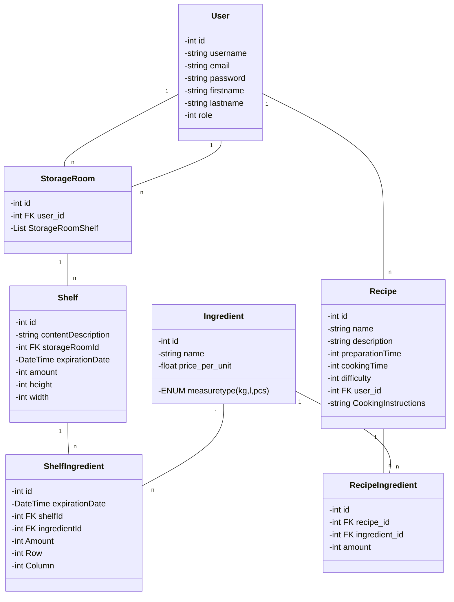

<!---
Artefakte der Systemdokumentation wurden mithilfe von ChatGPT (OpenAI) erstellt und manuell angepasst
-->
# Datenbankmodell RecipeNow

```mermaid 
classDiagram
    class User {
        -int id
        -string username
        -string email
        -string password
        -string firstname
        -string lastname
        -int role
    }

    class Ingredient {
        -int id
        -string name
        -ENUM measuretype (kg,l,pcs)
        -float price_per_unit
    }
    
    class Shelf {
        -int id
        -string contentDescription
        -int FK storageRoomId
        -DateTime expirationDate
        -int amount
        -int height
        -int width
    }


    class ShelfIngredient {
        -int id
        -DateTime expirationDate
        -int FK shelfId
        -int FK ingredientId
        -int Amount
        -int Row
        -int Column
    }
    
    class StorageRoom {
        -int id
        -int FK user_id
        -List StorageRoomShelf
    }
    
    
    class Recipe {
        -int id
        -string name
        -string description
        -int preparationTime
        -int cookingTime
        -int difficulty
        -int FK user_id
        -string CookingInstructions
    }
    
    class RecipeIngredient {
        -int id
        -int FK recipe_id
        -int FK ingredient_id
        -int amount
    }
    
    
    User "1" -- "n" StorageRoom
    User "1" -- "n" Recipe
    Recipe "1" -- "n" RecipeIngredient
    Ingredient "1" -- "n" RecipeIngredient
    StorageRoom "1" -- "n" Shelf
    User "1" -- "n" StorageRoom
    Shelf "1" -- "n" ShelfIngredient
    Ingredient "1" -- "n" ShelfIngredient
    
```
